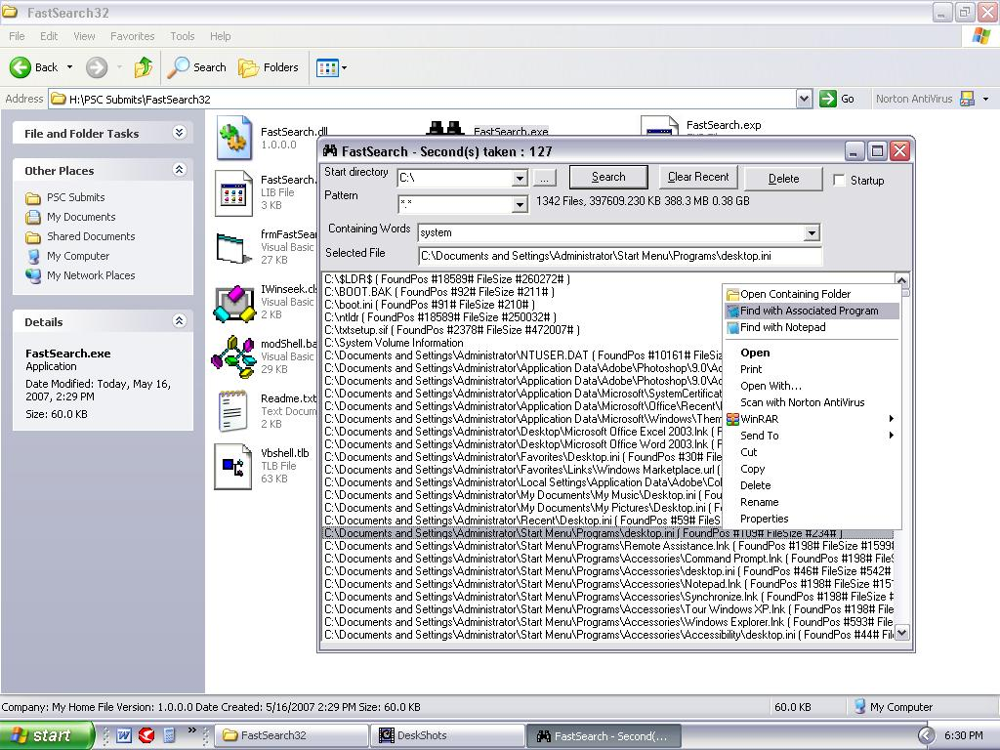



## FastSearch\-Included Typelibs

### Description

' 

----

' Name:   FastSearch

' Author:  Joshy Francis (joshylogicss@yahoo.co.in)

' Date:   14 May 2007

'

' Requires: None

'

' Copyright &#169; 2000-2007 Joshy Francis

' 

----

'The Fast File Searcing Utility.

'	

----

Features

----

'	1. Explorer Context Menu.

'	2. Drag-N-Drop to Explorer.

'	3. Search with Associated program.

'	4. Pattern Searching.

'	5. Fast File Cleaning.

'	6. Startmenu Shortcut-You can select this program from Startmenu-&gt; Search(StartMenu must be in Classic mode)

'	7. Faster than Windows Search.

'you can freely use this code anywhere.But I wants you must include the Copyright Info

'some of the functions from PSC

' 

----

'Steps in Installation

'	1.Open Project -&gt; Goto Reference-&gt; Add olelib.tlb &amp; vbshell.tlb to the Project(I Put it in the same app directory).I got it from PSC.

'     It wiil appear as below

'	  Edanmo's OLE interfaces for Implements v1.51

'	  VB Shell Library

'	2. Goto FastSearch Project Properties-&gt;General Tab : Change Project Type to ActiveX Dll.

'	  Change 'IFastSearch' Class module's Instancing to 5-MultiUse.

'	  Make the Project.

'	3. Goto FastSearch Project Properties-&gt;General Tab : Change Project Type to Standard Exe.

'	  Make &amp; Run the Project.

' If You use classic Start menu then Goto Start Menu-&gt; Search You can see 	FastSearch,clicking on it will be run our program.

'

'I Will submit fully commented version later.Please wait.

'Please..........Vote my program..........
 
### More Info
 

             |
---                |---
**Submitted On**   |2007-05-17 21:47:06
**By**             |[Joshy Francis](https://github.com/Planet-Source-Code/PSCIndex/blob/master/ByAuthor/joshy-francis.md)
**Level**          |Advanced
**User Rating**    |4.0 (8 globes from 2 users)
**Compatibility**  |VB 6\.0
**Category**       |[Windows API Call/ Explanation](https://github.com/Planet-Source-Code/PSCIndex/blob/master/ByCategory/windows-api-call-explanation__1-39.md)
**World**          |[Visual Basic](https://github.com/Planet-Source-Code/PSCIndex/blob/master/ByWorld/visual-basic.md)
**Archive File**   |[FastSearch2066425192007\.zip](https://github.com/Planet-Source-Code/joshy-francis-fastsearch-included-typelibs__1-68627/archive/master.zip)

